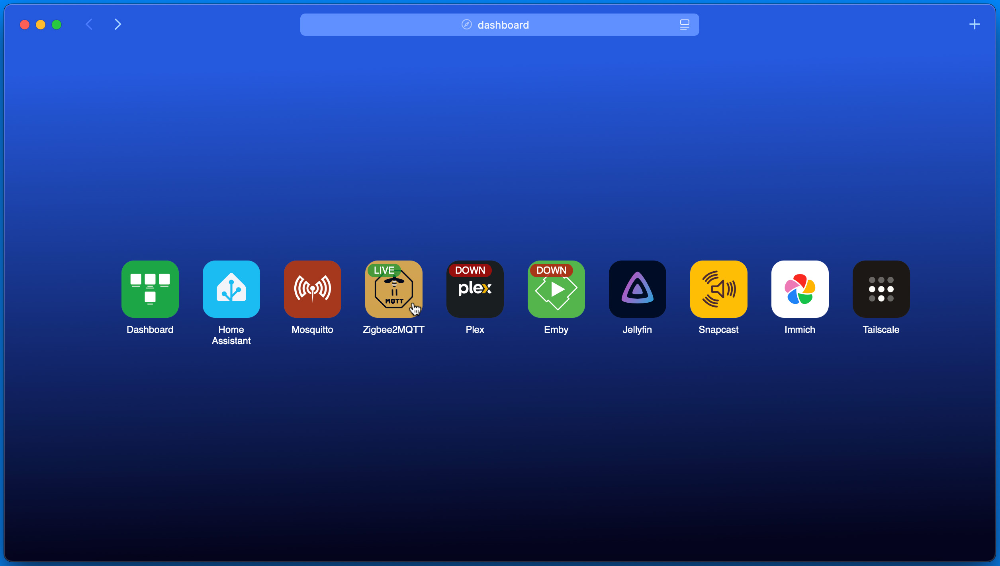

# Over simple Home lab dashboard

### Features

- config as JSON backup is just a file
  > Actually it's not JSON but a javascript object, potato, potahto
- No backend, it's all static, use any web server engine you'd like.
- Simple online/offline status
- beautiful
- ultra lightweight

### preview

Screenshot taken with safari :

