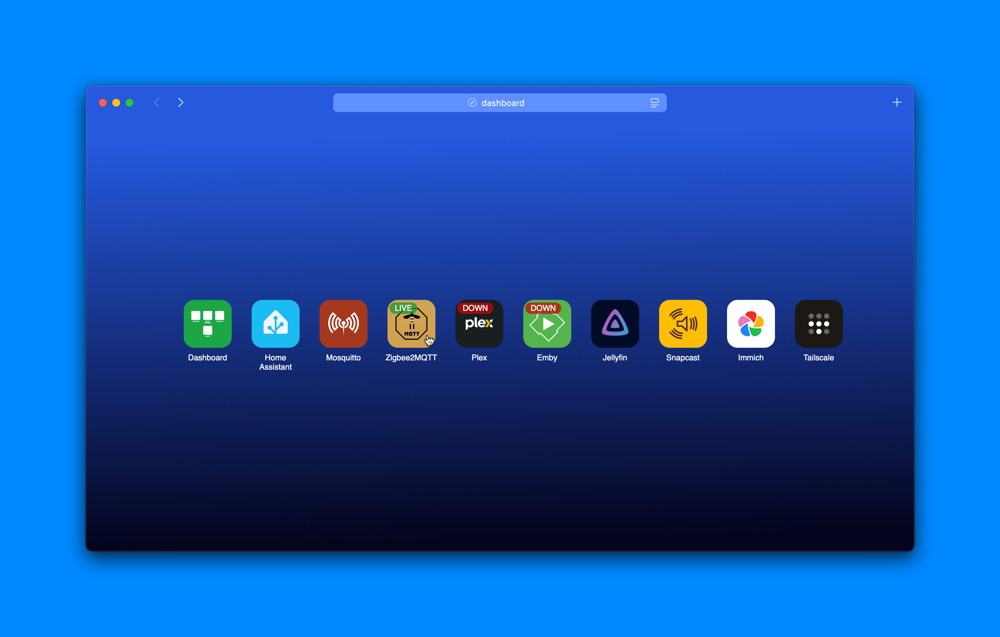

# Over simple Home lab dashboard

### Features

- config as JSON backup is just a file
  > Actually it's not JSON but a javascript object, potato, potahto
- No backend, it's all static, use any web server engine you'd like.
    > For exemple, try running the following in this folder :
    > ```bash
    > python3 -m http.server 8080
    > ```
    > You can now see your dashboard in your browser at localhost:8080 !
- Simple online/offline status
- beautiful
- ultra lightweight


### preview

Screenshot taken with safari :

